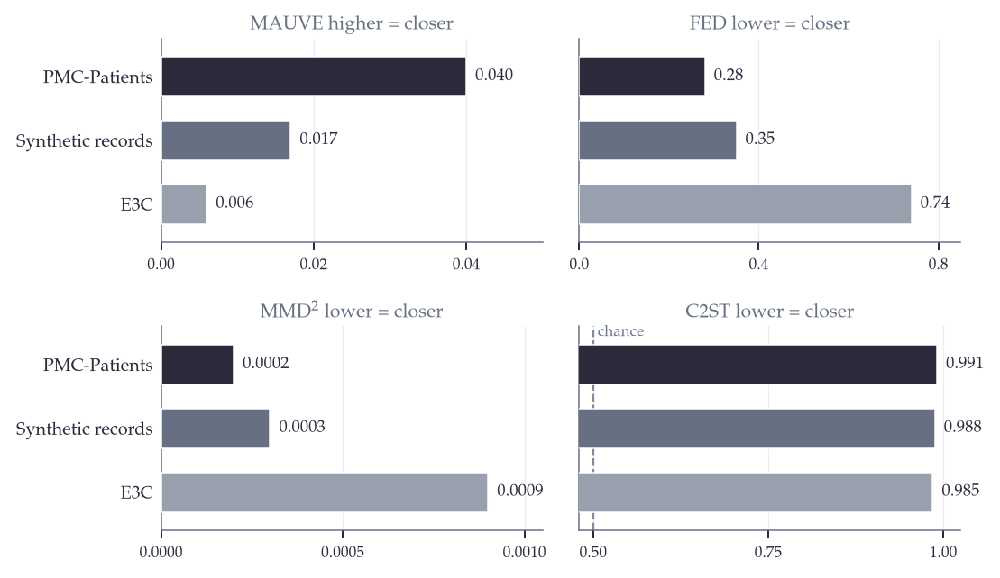
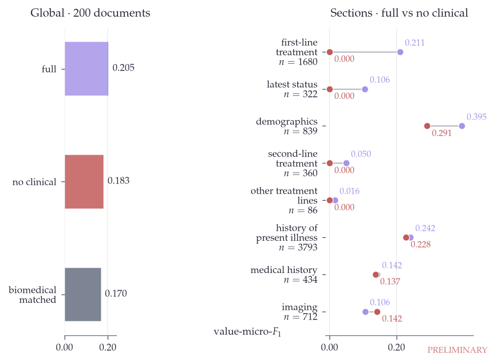
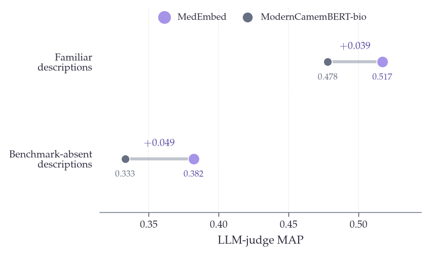
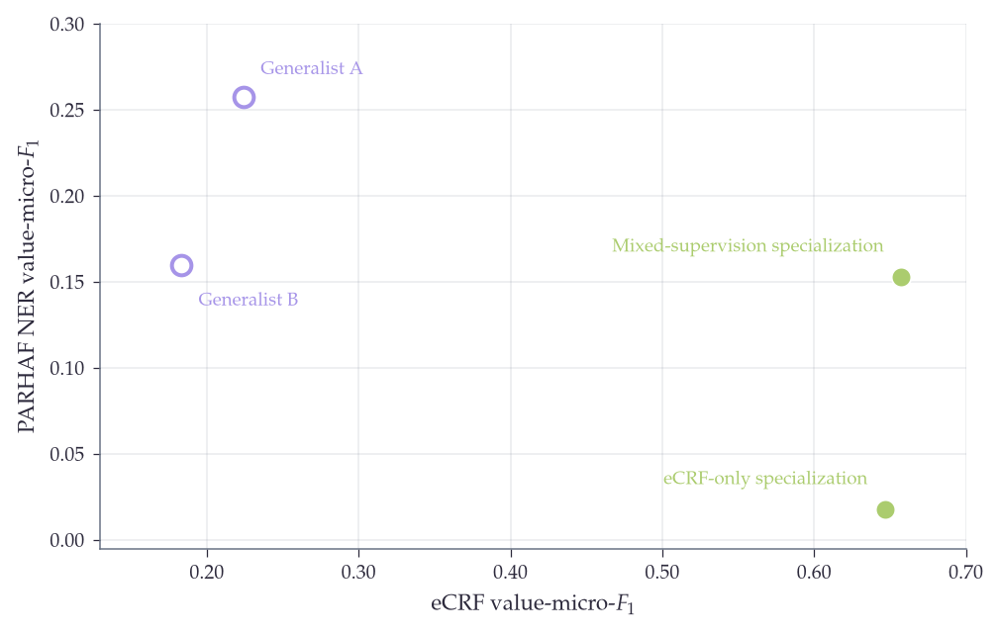
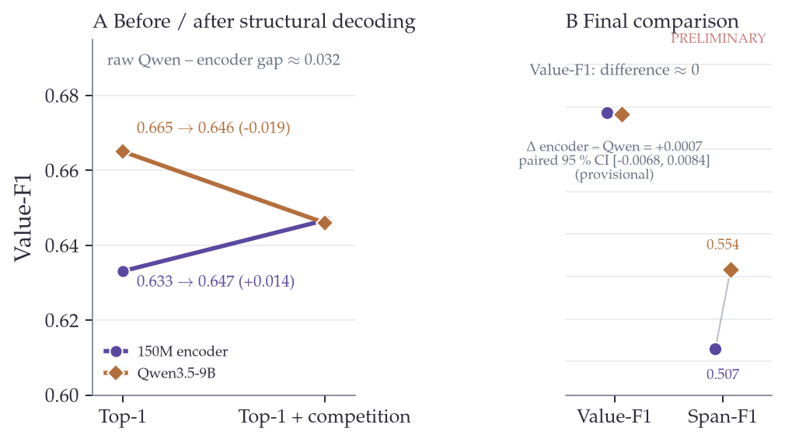

# Partie 3 — Adapter les encodeurs pré-entraînés sur données publiques à l'extraction clinique

## Introduction de la partie

### Des empans à un formulaire rempli

- Un clinicien qui rouvre un dossier ne veut pas seulement des mots surlignés. Il veut un formulaire rempli : une date de diagnostic, un stade, une ligne de traitement, un statut vital. La cible de cette partie est donc un dossier longitudinal composé de plusieurs comptes rendus et un schéma de sortie qui change avec chaque étude.
- Cette tâche va au-delà de la reconnaissance d'entités dans une phrase. Une même valeur peut apparaître à plusieurs dates, et son rôle dépend du parcours du patient. Le même traitement peut ainsi correspondre à une première ligne puis à une deuxième ligne après rechute.

> **Figure 1 — du dossier longitudinal au formulaire.** Dans le dossier synthétique `lym_76`, `CHOEP-14` apparaît avant puis après la rechute et alimente deux champs distincts. La répétition de la même chaîne montre que la cible est un rôle situé dans la trajectoire, et non un empan isolé.

### Trois contraintes

- Nous n'avons identifié aucun corpus ouvert de vrais dossiers hospitaliers français permettant d'entraîner et d'évaluer cette tâche longitudinale. La confidentialité protège les patients, et un modèle entraîné sur des notes privées peut mémoriser puis restituer des données personnelles.
- Le vocabulaire de sortie est ouvert. Les champs changent d'une cohorte à l'autre, si bien qu'une couche de classification fixe ne peut pas émettre un type absent de son entraînement.
- Le budget d'annotation est proche de zéro pour chaque nouveau formulaire. Le système doit donc apprendre à partir de texte public, de connaissances structurées et de supervision générée.
- La partie 1 a rassemblé et caractérisé le texte biomédical public. La partie 2 a produit ModernCamemBERT-bio, un encodeur biomédical français à contexte long. Cette partie ajoute la supervision et l'architecture nécessaires pour l'adapter à une tâche clinique.

### Évaluer une cible inaccessible

- L'expérience que nous voudrions mener est simple à formuler : entraîner sans dossiers privés, puis évaluer le remplissage d'un eCRF sur des dossiers hospitaliers français annotés par des cliniciens. Aucun jeu ouvert ne permet actuellement cette expérience. Le manque de données concerne donc l'entraînement et l'évaluation.
- Nous décomposons la question en plusieurs régimes. Aucun ne remplace un gold hospitalier, mais chacun teste une partie différente du problème.

> **Figure 2 — faisceau de preuves autour d'une cible inaccessible.** Le capstone synthétique, PARHAF, FrACCO et le juge sans référence éclairent quatre dimensions complémentaires ; leur zone commune ne contient toujours pas la validité clinique sur de vrais dossiers hospitaliers français.

**Tableau 1 — Chaque régime couvre une dimension du problème sans établir, à lui seul, la validité clinique sur des dossiers hospitaliers réels.**

| régime | nature | ce qu'il permet de tester | ce qu'il ne démontre pas |
|---|---|---|---|
| eCRF lymphome | 2 050 dossiers longitudinaux synthétiques, référence silver produite par modèle | adaptation à 89 champs, liage aux lignes de traitement, décodage du formulaire, efficacité-données | transfert vers le registre hospitalier réel et exactitude contre une annotation humaine |
| PARHAF biomarqueurs | comptes rendus fictifs rédigés par des internes, 31 documents de test | transfert vers un texte humain qui imite le registre hospitalier | performance sur des dossiers de soins réels et stabilité des petits écarts |
| FrACCO | cas oncologiques traduits de l'espagnol, NER dense sur 300 documents de test | transfert externe vers un autre domaine et une autre densité d'annotation | remplissage longitudinal d'un formulaire clinique |
| juge sans référence | empans proposés sur des types courants et absents des benchmarks | généralisation à des descriptions de types nouvelles, sans choisir de seuil | exactitude médicale contre un gold humain |

- La référence principale est donc un silver gold. Le même grand modèle participe à la génération des dossiers et à leur annotation, puis les offsets sont reconstruits de manière déterministe. Ce protocole permet une comparaison contrôlée entre modèles. Il ne mesure pas une vérité clinique humaine et peut favoriser les conventions du générateur.
- Les résultats doivent être lus selon cette hiérarchie. Le capstone mesure la validité interne sur une tâche longitudinale synthétique. PARHAF et FrACCO testent des transferts externes plus étroits. L'étape décisive reste une évaluation sur des dossiers hospitaliers réels annotés par des cliniciens.

### Approche et organisation

- La question de la partie est la suivante : jusqu'où un petit encodeur biomédical peut-il être adapté à une tâche clinique sans utiliser de dossiers hospitaliers pour l'entraînement ? Nous étudions trois éléments : construire la supervision manquante, rendre les types de sortie paramétrables à l'inférence, puis remplir le formulaire complet face aux grands modèles de langage.
- Le premier chapitre construit deux formes de supervision synthétique à partir de ressources publiques. Le deuxième transforme ModernCamemBERT-bio en extracteur à vocabulaire ouvert et étudie ce qui détermine son transfert zéro-shot. Le troisième évalue le système sur le capstone lymphome, puis mesure ses limites sur PARHAF et FrACCO.
- Le capstone eCRF lymphome reste le cœur de la partie. Les deux jeux externes délimitent la portée de ses conclusions.

## Chapitre 1 — Construire la supervision sans dossiers hospitaliers

- Les ressources publiques ne prennent pas la forme attendue par la tâche. La littérature contient des entités médicales mais pas les champs d'un nouveau formulaire. Les cas publiés décrivent des patients mais rarement un dossier longitudinal composé de comptes rendus successifs. Nous les transformons par deux voies complémentaires : annoter le texte public pour entraîner l'extracteur généraliste, puis réécrire des cas publics pour construire le capstone.
- Un seul modèle est utilisé pour ces opérations, `Qwen3-235B-A22B-Instruct-2507-FP8`, servi par vLLM sur quatre GPU H100 avec une sortie JSON contrainte par schéma.

> **Figure 3 — deux voies de supervision, deux fonctions.** L'annotation de paragraphes publics produit le généraliste à vocabulaire ouvert ; la génération longitudinale à partir de PMC-Patients puis TAPDL produit le spécialiste du formulaire. Les voies ne convergent qu'au moment de la spécialisation et ne sont pas deux versions interchangeables d'un même corpus.

### Annoter le texte biomédical public

- Le grand modèle annote chaque passage avec des entités, leurs descriptions de type, une classification et une structure. Les sorties sont contraintes en JSON. Chaque mention est ensuite ancrée dans le texte, et les documents sans entité sont conservés comme négatifs.
- Le corpus échantillonne six sources : HAL et ISTEX (50 000 documents chacun, filtrés par qualité et stratifiés par type de contenu), des passages contenant des cas patients (40 000), des cas cliniques traduits en français (30 000), de l'encyclopédie biomédicale (20 000) et des manuels issus de la CCAM, de la CIM-10 et de l'ATC.
- Après annotation et déduplication, le jeu utilisé pour `ModernCamemBERT-bio-gliner-base` contient 118 687 documents et 14,7 mentions par document en moyenne.

**Tableau 2 — La provenance détermine la supervision produite et les conditions de redistribution ; les licences hétérogènes restent attachées aux documents sources.**

| source publique | volume mobilisé | statut de licence à conserver | usage en aval |
|---|---:|---|---|
| HAL | 50 000 documents échantillonnés | licence de chaque dépôt, héritée de la partie 1 | annotation du généraliste |
| ISTEX | 50 000 documents échantillonnés | droits et licences de chaque document, hérités de la partie 1 | annotation du généraliste |
| passages centrés patient | 40 000 passages | licence de l'article source | annotation du généraliste |
| cas cliniques traduits | 30 000 cas | licence du corpus source et statut de la traduction | annotation du généraliste |
| encyclopédie biomédicale | 20 000 passages | licence de la ressource source | annotation du généraliste |
| CCAM, CIM-10 et ATC | volume inclus dans le jeu final | conditions propres à chaque nomenclature | descriptions et terminologie |
| PMC-Patients | 167 034 cas dans le corpus source | carte du jeu : CC BY-NC-SA 4.0 ; compatibilité du dérivé à vérifier | sélection de trajectoires puis génération du capstone |
| jeu annoté final | 118 687 documents | redistribution conditionnée par les licences amont | entraînement de `ModernCamemBERT-bio-gliner-base` |

### Générer des dossiers longitudinaux

- Un compte rendu décrit un instant, tandis qu'un dossier couvre plusieurs mois ou plusieurs années. Nous partons de `PMC-Patients`, une collection anglaise de cas cliniques publiés. Un score de richesse favorise les parcours qui mentionnent une rechute ou une deuxième ligne de traitement. Chaque patient reçoit ensuite une identité française fictive et reproductible : nom, hôpital, ville et année d'ancrage.
- La génération comporte quatre étapes. La première transforme le cas anglais en chronologie française structurée. La deuxième harmonise les dates, les âges et les valeurs bornées. La troisième génère chaque compte rendu avec les seuls événements antérieurs pertinents pour son type. La quatrième réextrait la chronologie afin de contrôler la cohérence du dossier produit.
- Le registre, les abréviations et le texte continu sont obtenus par le prompt. Aucune étape programmatique ne dégrade le texte.

> **Figure 4 — génération longitudinale en front d'onde.** Au temps $t$, le prompt ne voit que l'identité fictive et les événements déjà survenus ; les événements futurs restent masqués. La succession de vues partielles, et non une réécriture globale du cas, empêche la fuite du futur vers les comptes rendus antérieurs.

- La production contient 2 050 dossiers. La médiane est de huit comptes rendus, dix-huit événements et 22 314 caractères par dossier. Trente et un pour cent des dossiers contiennent une deuxième ligne de traitement. Le taux de rechute annoncé à 91 % doit être recompté depuis la production avant d'être figé dans le manuscrit.
- Un exemple du pipeline part d'un cas publié décrivant un lymphome lymphocytique traité par FC puis rituximab-bendamustine. La sortie contient cinq documents français, dont un compte rendu anatomo-pathologique avec microscopie et immunohistochimie.

### Construire la référence silver avec TAPDL

- TAPDL reconstruit la grille de réponses compte rendu par compte rendu. Le modèle reçoit la date, le type de document et les événements vérifiés qui lui correspondent. Ces événements servent à identifier le rôle, notamment la ligne de traitement, mais le modèle ne doit extraire que les informations écrites dans le compte rendu.
- Le modèle renvoie une paire composée d'un champ et d'une chaîne. Il ne produit ni offset ni valeur normalisée. L'assembleur recherche la chaîne dans le compte rendu, remappe les offsets dans le dossier complet et stocke directement la tranche de texte correspondante.

> **Figure 5 — de la proposition sémantique aux offsets auditables.** Une unique sortie champ–chaîne du LLM traverse recherche littérale, repli approximatif, remappage global et résolution des collisions. Le modèle propose le sens ; les offsets et l'exclusivité finale sont établis de façon déterministe.

- Le pipeline réel comporte une seule passe LLM suivie d'une validation déterministe. Sur 275 544 extractions brutes, 15 868 chaînes ne sont pas retrouvées littéralement. Le repli approximatif en récupère 7 441, soit 3,1 % de la grille finale. L'assembleur résout 27 491 collisions brutes.
- La grille finale contient 237 194 empans et couvre 89 champs. Les 2 050 dossiers sont répartis en 1 640 dossiers d'entraînement et 410 de test. Cent dossiers du premier groupe servent à la validation, ce qui laisse 1 540 dossiers pour le plus grand entraînement.

**Tableau 3 — TAPDL réduit une proposition sémantique générée à une référence d'empans sans offsets inventés par le LLM.**

| étape d'audit | compte | portée |
|---|---:|---|
| propositions brutes | 275 544 | paires champ–chaîne émises par le LLM |
| chaînes sans correspondance littérale | 15 868 | candidates au repli approximatif ou au rejet |
| récupérations approximatives | 7 441 | 3,1 % de la grille finale |
| collisions brutes | 27 491 | affectations concurrentes résolues par l'assembleur |
| empans finaux | 237 194 | offsets globaux sans collision sur 89 champs |
- L'exactitude entre les valeurs stockées et leurs offsets est vraie par construction, puisque la valeur est la tranche de texte à ces offsets. De même, l'absence de collision finale résulte de l'étape qui les supprime. Les autres limites sont une troncature des comptes rendus à 8 000 caractères dans le prompt, environ 2,3 % de comptes rendus abandonnés et l'absence de contrôle documenté du split au niveau de l'article PMC source.

### Mesurer la distance au registre hospitalier

- PARHAF est le proxy humain fictif le plus proche dont nous disposons, et non un corpus de dossiers hospitaliers réels. Nous comparons les distributions dans l'espace de MedEmbed avec MAUVE, FED, MMD et un classifieur à deux échantillons.

*Figure 6. Les trois sources restent presque parfaitement séparables de PARHAF ; les variations de distance entre corpus ne doivent donc pas être confondues avec une reproduction du registre hospitalier.*

**Tableau 4 — Les quatre métriques enregistrées convergent vers une signature synthétique ou éditoriale encore facilement détectable ($n=1\,000$ par source).**

| source comparée à PARHAF | MAUVE (haut = proche) | FED (bas = proche) | MMD² (bas = proche) | C2ST (bas = proche) |
|---|---:|---:|---:|---:|
| PMC-Patients brut | 0.040 | 0.28 | 0.0002 | 0.991 |
| dossiers synthétiques | 0.017 | 0.35 | 0.0003 | 0.988 |
| E3C, cas cliniques publiés | 0.006 | 0.74 | 0.0009 | 0.985 |

- Le C2ST est proche de 0,99 pour toutes les sources. Elles sont donc facilement distinguables de PARHAF. Les dossiers synthétiques sont plus proches que les cas publiés E3C, mais moins proches que leur propre source PMC-Patients. La génération fournit une supervision adaptée à la tâche sans reproduire le registre hospitalier.
- Le chapitre suivant étudie l'autre moitié du problème. Même avec des données annotées, une couche de sortie fixe ne peut pas répondre à un formulaire dont les champs changent.

## Chapitre 2 — Extraction à vocabulaire ouvert

### Donner les types à l'inférence

- GLiNER compare chaque empan candidat à une description de type fournie à l'inférence. Le schéma n'est donc pas limité aux classes vues pendant l'entraînement : une nouvelle description peut être présentée sans reconstruire la couche de sortie.
- Deux propriétés doivent être évaluées séparément. L'encodeur de descriptions doit généraliser à des types absents de l'entraînement. L'extracteur spécialisé doit ensuite conserver cette capacité lorsqu'il apprend une tâche particulière.

### MedEmbed, l'encodeur de descriptions

- Le chapitre 5 produit ModernCamemBERT-bio en adaptant ModernCamemBERT par un détour CLM. Le chapitre 6 fournit des textes et des relations issus des terminologies médicales. Dans cette partie, ces ressources servent à construire des paires terminologiques pour une étape contrastive, qui produit MedEmbed. OntoBook contribue donc au signal et aux paires ; son checkpoint n'est pas empilé après le checkpoint CLM.
- Sur OntoBench-FR, MedEmbed atteint 58,1 en récupération terminologique, contre 48,9 pour mE5, 47,2 pour BGE-M3 et 44,9 pour Solon. L'ascendance exacte du checkpoint utilisé par MedEmbed doit être reprise depuis la configuration du run dans la description finale.

> **Figure 7 — lignée de MedEmbed et extraction à vocabulaire ouvert.** Le texte biomédical de la partie 1 et les paires terminologiques d'OntoBook façonnent un espace de descriptions commun aux empans ; à l'inférence, une description nouvelle guide la recherche par similarité sans devenir une classe fixe.

### Entraîner l'extracteur

- L'extracteur est entraîné sur les annotations du premier chapitre, sans label provenant d'un dossier hospitalier réel. Le modèle publié, `ModernCamemBERT-bio-gliner-base`, mélange à parts égales les descriptions brutes proposées par l'annotateur et leur forme canonique.
- Ce mélange produit un généraliste à vocabulaire ouvert. Il ne garantit pas que cette capacité survive à une spécialisation ultérieure sur le lymphome.

### Ce qui détermine le transfert zéro-shot

- Les variantes changent les données, le backbone ou la fonction de perte. Elles sont utilisées comme diagnostics de mécanisme, avec des niveaux de preuve différents.

*Figure 8. La densité d'annotation apprend d'abord combien d'entités proposer, tandis que l'apport du texte clinique public se concentre sur les champs de traitement et disparaît dans une moyenne globale.*

**Tableau 5 — Les interventions n'autorisent une interprétation mécanistique que lorsque leur contrôle isole effectivement le facteur annoncé.**

| intervention | constat | interprétation autorisée |
|---|---|---|
| densité et documents vides | 22,5 % de documents vides conduisent à une sous-prédiction ; corriger la densité restaure le volume | la densité d'annotation apprend en partie au modèle combien d'entités proposer |
| étage contrastif | MedEmbed apporte +0,049 de MAP sur les types nouveaux et environ +0,023 sur l'eCRF dans l'A/B courant | l'espace des descriptions contribue à la généralisation ; chiffres encore à enregistrer dans `results.json` |
| texte clinique public | l'ablation globale est faible, mais les sections de traitement tombent à 0 en zéro-shot sans ce contenu | le signal est concentré sur le parcours thérapeutique ; résultat mesuré sur 200 dossiers |
| focal loss | elle empêche le collapse de GLiNER v1 et améliore GLiNER2 sur les jeux externes | finding ouvert : les budgets et plusieurs paramètres d'architecture ne sont pas complètement appariés |

- L'ablation du contenu clinique relie directement cette partie à la construction du corpus. L'effet global est de 0,138 contre 0,117, mais la moyenne masque un effet local : les premières et deuxièmes lignes de traitement tombent à 0, tandis que la section `history`, qui représente 46 % du gold, reste pratiquement inchangée.

### Évaluer les descriptions absentes des benchmarks

- Un benchmark fixe ne mesure que les types qu'il contient. Nous complétons donc les évaluations par un juge sans référence. Les empans proposés par les modèles sont regroupés, dédupliqués et présentés sans leur origine à un grand modèle, qui évalue leur compatibilité avec la description demandée.
- La MAP évite de fixer un seuil de décision. Nous séparons les types courants des types construits pour être absents des benchmarks. Dans le run courant, le modèle publié atteint une MAP de 0,474 sur ces types. Cette valeur et l'A/B MedEmbed doivent encore être remontés depuis la source primaire vers `results.json`.
- Le protocole mesure une préférence du juge et non une exactitude médicale humaine. Le même modèle Qwen3-235B intervient également dans plusieurs étapes de construction des données. Cette dépendance doit être explicitée, et un contrôle humain reste nécessaire pour valider le juge.

*Figure 9. APERÇU PROVISOIRE — Le gain contrastif paraît se concentrer sur les descriptions construites pour être nouvelles, mais les valeurs A/B ne sont pas encore enregistrées dans `results.json` et le signal reste une préférence de juge, non un gold médical.*

**Tableau 6 — Les tests fixes établissent la qualité de l'espace terminologique ; le juge étend l'observation aux types nouveaux avec un niveau de preuve plus faible.**

| évaluation | système ou contraste | résultat courant | statut et limite |
|---|---|---:|---|
| OntoBench-FR, benchmark fixe | MedEmbed | 58,1 | résultat fixe de récupération terminologique |
| OntoBench-FR, benchmark fixe | mE5 / BGE-M3 / Solon | 48,9 / 47,2 / 44,9 | baselines fixes |
| eCRF, 89 descriptions fixes | avec vs sans étage contrastif | environ +0,023 | A/B provisoire, à enregistrer dans `results.json` |
| juge, types nouveaux | modèle publié | MAP 0,474 | provisoire ; préférence du juge sans gold humain |
| juge, types nouveaux | gain de MedEmbed dans l'A/B | +0,049 MAP | provisoire ; même dépendance au juge |

### La spécialisation efface l'ouverture

- La qualité du généraliste ne prédit pas la performance du spécialiste. Plusieurs généralistes très différents finissent entre 0,646 et 0,657 après spécialisation sur l'eCRF.
- En sens inverse, la spécialisation lymphome détruit une grande partie du transfert zéro-shot vers les types PARHAF. Le modèle spécialisé sans mélange cesse de prédire ces types. Le mélange de données généralistes limite la perte, mais ne la supprime pas.
- Le résultat est donc un compromis. L'étage contrastif améliore le transfert sans supervision spécifique, tandis que l'adaptation à un formulaire précis réduit cette capacité. Le capstone doit mesurer la performance spécialisée et la capacité générale séparément.

*Figure 10. Les spécialistes convergent sur le formulaire cible tout en perdant l'essentiel de leur transfert PARHAF ; le mélange amortit cette fermeture sans conserver entièrement l'ouverture du généraliste.*

- Une architecture à vocabulaire ouvert peut demander de nouveaux types. Elle ne résout pas encore le liage entre une valeur et son rôle dans le parcours du patient. Le dernier chapitre porte donc sur le formulaire complet.

## Chapitre 3 — Remplir un formulaire clinique longitudinal

### Le capstone OncoLab

- OncoLab est une cohorte de patients atteints de lymphome en rechute. Le formulaire contient 89 champs répartis en dix sections : démographie, antécédents, histoire de la maladie, première et deuxième lignes de traitement, imagerie et dernières nouvelles. La section `history` contient 31 champs, dont les biomarqueurs BCL2, BCL6 et MYC en FISH et en immunohistochimie.
- La principale difficulté est le liage au rôle. Dans le dossier synthétique `lym_76`, le protocole CHOEP-14 apparaît en première ligne puis en deuxième ligne après une rechute. La chaîne locale ne suffit pas à déterminer le champ : l'information se trouve dans la chronologie du dossier.
- Un extracteur d'empans attribue des scores localement à chaque couple empan-description. Il ne maintient pas un état explicite du parcours du patient. Le grand modèle génère au contraire l'ensemble de la réponse conjointement, mais avec un coût de déploiement plus élevé.
- Le protocole utilise 1 540 dossiers synthétiques pour l'entraînement, 100 pour la validation et 410 pour le test. Aucun de ces dossiers n'est un compte rendu hospitalier réel. L'absence d'identifiant ou de texte généré commun a été vérifiée ; le split au niveau des articles PMC sources reste à contrôler.

### Protocole d'évaluation

- Un formulaire demande une valeur par champ. Pour chaque couple composé d'un dossier et d'un champ, nous gardons donc la prédiction la plus confiante. Une valeur fausse compte comme un faux positif et un faux négatif.
- PARHAF et FrACCO sont des tâches de NER multi-mention. Nous les évaluons séparément avec un micro-$F_1$ sur toutes les mentions et un appariement glouton par confiance.
- Le span-$F_1$ accepte tout chevauchement non vide entre une prédiction et un empan de référence. Cette mesure est permissive. Le value-$F_1$ compare les ensembles de tokens normalisés avec un Jaccard supérieur ou égal à 0,5. Il mesure une ressemblance de surface, pas l'équivalence clinique de valeurs telles que deux formats de date.
- Les scores actuels choisissent le seuil par cross-fit sur deux moitiés des 410 dossiers. Cette procédure ne choisit et ne rapporte jamais le seuil sur la même moitié, mais elle utilise néanmoins le test pour la sélection. Le protocole final doit fixer les seuils sur les 100 dossiers de validation, puis évaluer les 410 dossiers une seule fois.
- Les comparaisons principales doivent être accompagnées d'intervalles de confiance appariés. Les résultats GLiNER du capstone restent provisoires tant que les parquets inférés à 0,001 n'ont pas confirmé ceux actuellement tronqués à 0,1 avant scoring.

> **Figure 11 — quatre unités d'évaluation sur une même phrase.** Le même exemple clinique produit une valeur unique pour l'eCRF, plusieurs mentions pour le NER, un chevauchement pour le span-$F_1$ et une similarité de tokens pour le value-$F_1$. Les scores ne sont donc pas des mesures interchangeables d'une même sortie.

**Tableau 7 — Le score change d'interprétation avec l'unité, la règle d'appariement et la provenance du seuil.**

| jeu ou mesure | unité évaluée | appariement | source du seuil | limite principale |
|---|---|---|---|---|
| eCRF, value-$F_1$ | une valeur par dossier et champ | Jaccard des tokens normalisés $\geq 0,5$ | cross-fit courant sur le test ; validation prévue | ressemblance de surface, pas équivalence clinique |
| eCRF, span-$F_1$ | un empan retenu par champ | tout chevauchement non vide | cross-fit courant sur le test ; validation prévue | frontière très permissive |
| PARHAF et FrACCO | toutes les mentions | appariement glouton par confiance | validation propre à chaque jeu | NER dense, non-remplissage longitudinal |
| juge sans référence | liste classée d'empans | préférence du juge, résumée par MAP | aucun seuil de décision | absence de gold médical humain |

### Les modèles sont déjà proches avant le décodage

- Les familles reçoivent la même tâche et une supervision alignée, mais pas un entraînement identique : leurs formats, objectifs et recettes d'optimisation diffèrent. Nous comparons les extracteurs d'empans, quatre tailles de Qwen3.5, deux modèles de QA extractive et la baseline `gliner-biomed`.
- Sur les parquets actuels et avant la compétition entre champs, Qwen3.5-9B atteint 0,665 et l'encodeur publié de 150 M atteint 0,633 en value-$F_1$. L'écart est de 3,2 points pour un facteur 60 en nombre de paramètres. Le grand modèle mène, mais le petit encodeur est déjà proche avant d'exploiter la structure du formulaire.
- Cette comparaison brute est importante. Le décodage structurel ne crée pas à lui seul la compétitivité du modèle ; il ferme un écart initial limité.

### Ajouter la structure du formulaire

- Le score brut ignore deux contraintes du formulaire : un empan ne doit documenter qu'un champ, et chaque champ ne conserve qu'une valeur finale. Dans le post-traitement, les champs qui réclament des empans fortement chevauchants entrent en compétition, puis la prédiction la plus confiante est gardée.
- Dans `lym_10`, le caractère « 2 » d'un SUVmax de 3,2 est proposé pour `history_bcl2_fish` avec une confiance de 0,792 et pour `history_bcl2_ihc` avec 0,415. La compétition garde le premier champ. L'exemple montre également que la contrainte ne corrige pas un empan cliniquement faux : elle choisit seulement entre deux affectations concurrentes.

- Sur les douze modèles étudiés, la compétition aide les huit extracteurs d'empans et dégrade les quatre grands modèles. Le générateur produit déjà une réponse conjointe dans un JSON guidé ; lui appliquer ensuite une compétition entre valeurs est redondant.
- Pour le modèle publié, le décodage fait passer le value-$F_1$ d'environ 0,633 à 0,647, soit +0,014. Pour Qwen3.5-9B, il le fait passer d'environ 0,665 à 0,646, soit -0,019. Ces valeurs remplacent la table plus ancienne calculée sur un autre point de départ et un ancien run du LLM.
- Le bootstrap apparié courant donne un gain de +0,0136 pour l'encodeur, avec un IC 95 % de [+0,0107 ; +0,0163], et une baisse de -0,0190 pour Qwen, avec un IC de [-0,0216 ; -0,0166]. Après décodage, la différence entre l'encodeur et Qwen est de +0,0007, avec un IC de [-0,0068 ; +0,0084]. Aucun modèle n'est supérieur de manière établie sur le value-$F_1$ final.
- TAPDL résout lui-même les collisions de la référence selon une contrainte proche. Le décodeur et le gold sont donc co-conçus autour du même schéma. Ce choix est cohérent pour remplir ce formulaire, mais il ne démontre pas que la compétition est une propriété générale de l'extraction clinique.

### Comparaison finale

*Figure 12. APERÇU PROVISOIRE — Avant la compétition entre champs, Qwen3.5-9B devance l'encodeur de 150 M de 3,2 points. La contrainte aide l'extracteur et dégrade le générateur ; après son application, leur différence de value-$F_1$ est indétectable dans l'intervalle de confiance courant, encore à enregistrer dans `results.json`.*

**Tableau 8 — La comparaison complète sépare le value-$F_1$ du span-$F_1$ et réserve l'inférence appariée à la comparaison principale.**

| modèle | paramètres | value-$F_1$ | span-$F_1$ | incertitude principale |
|---|---:|---:|---:|---|
| ModernCamemBERT-bio-gliner-base (mélange) | 150 M | 0,657 | 0,507 | — |
| ModernCamemBERT-bio-gliner-base | 150 M | 0,647 | 0,507 | différence vs Qwen : +0,0007, IC 95 % [−0,0068 ; +0,0084] |
| Qwen3.5-9B | 9 B | 0,646 | 0,554 | référence de la comparaison appariée |
| Qwen3.5-2B | 2 B | 0,642 | 0,556 | — |
| ModernCamemBERT-bio-gliner-large | 400 M | 0,636 | 0,507 | — |
| Qwen3.5-0.8B | 0,8 B | 0,625 | 0,541 | — |
| Qwen3.5-4B | 4 B | 0,615 | 0,525 | run incomplet : 71 champs sur 89 |
| QA extractif biomédical | 150 M | 0,419 | 0,364 | — |
| gliner-biomed, baseline publiée | environ 200 M | 0,382 | 0,397 | fenêtres glissantes |
| QA extractif général | 150 M | 0,338 | 0,312 | — |

- L'encodeur publié et Qwen3.5-9B sont à égalité dans le bruit sur le value-$F_1$, à 60 fois moins de paramètres pour l'encodeur. Le grand modèle conserve un meilleur span-$F_1$. Le mélange de données généralistes atteint 0,657 sans coût observé sur la tâche cible, mais il ne préserve qu'une partie de la capacité zéro-shot externe.
- La baseline `gliner-biomed` est évaluée par fenêtres glissantes afin de compenser son contexte de 2 048 tokens. Son score passe de 0,351 à 0,382 lorsque tout le dossier devient atteignable. L'écart restant porte donc principalement sur la discrimination des 89 champs.
- Les résultats restent provisoires : le parquet GLiNER principal a été produit avec un seuil d'inférence de 0,1, et le run Qwen3.5-4B ne remplit que 71 des 89 champs.

### Ce que le score final masque

*Figure 13. APERÇU PROVISOIRE — À value-$F_1$ final comparable, Qwen commet moins d'erreurs de rôle et ordonne mieux son incertitude ; l'avantage de l'encodeur concerne donc l'empreinte, pas l'équivalence des comportements d'erreur. La taxonomie des erreurs reste à régénérer depuis les prédictions avant rendu final.*

- Le grand modèle relie mieux la valeur à son rôle. Parmi les erreurs analysées, 40,5 % sont des cas « bonne valeur, mauvais champ » pour Qwen, contre 60,5 % pour l'encodeur. Cette analyse doit être ajoutée au registre de résultats avant citation définitive.
- Qwen est également mieux calibré dans l'analyse actuelle : son aire sous la courbe risque-couverture est de 0,228, contre 0,313 pour l'encodeur. Garder la moitié la plus confiante porte la précision à 0,813 contre 0,667. L'avantage du petit modèle porte sur l'empreinte et non sur la connaissance de son propre doute.
- L'encodeur n'est pas plus rapide par dossier lorsque les 89 descriptions sont évaluées. Son avantage de déploiement est une empreinte d'environ 150 M de paramètres, inférieure à un gigaoctet selon la précision utilisée, contre environ 18 Go pour un modèle 9 B en bfloat16.

### Pourquoi le QA extractif décroche

- Une tête de type SQuAD renvoie un empan principal par question, tandis que le dossier contient plusieurs mentions et plusieurs formes de la même valeur. La baseline QA n'est en outre entraînée que sur la première mention de chaque champ.
- Sa confiance est peu discriminante dans l'implémentation actuelle : sur PARHAF, 72,4 % des prédictions sont à égalité. Le value-$F_1$ reste interprétable, mais l'analyse d'abstention du QA ne l'est pas.

### Quantité de supervision synthétique

- Dans le rescore courant, encore provisoire, la courbe d'efficacité-données passe de 0,182 avec 10 dossiers à 0,485 avec 50, 0,544 avec 100, 0,603 avec 500 et 0,659 avec 1 540. Cinquante dossiers atteignent ainsi 74 % de la performance finale.
- Sous réserve d'enregistrer ces cinq points dans `results.json`, la courbe indique qu'une petite quantité de supervision synthétique suffit à obtenir une grande partie du résultat. Elle ne mesure pas directement le coût d'une annotation humaine équivalente.

### Validations externes

**Tableau 9 — Les adaptations externes confirment le régime bas-ressource sur PARHAF mais montrent une limite nette sur le NER dense de FrACCO.**

| jeu | modèle | zéro-shot | finetuné sur 100 documents |
|---|---|---:|---:|
| PARHAF | Qwen3.5-2B | — | 0,740 |
| PARHAF | Qwen3.5-9B | 0,595 | 0,726 |
| PARHAF | densité corrigée | 0,246 | 0,695 |
| PARHAF | ModernCamemBERT-bio-gliner-base | 0,258 | 0,692 |
| PARHAF | sous-annoté | 0,160 | 0,655 |
| PARHAF | gliner-biomed | 0,468 | 0,573 |
| FrACCO | gliner-biomed | 0,362 | 0,867 |
| FrACCO | densité corrigée | 0,294 | — |
| FrACCO | sous-annoté | 0,217 | 0,627 |
| FrACCO | ModernCamemBERT-bio-gliner-base | 0,243 | 0,626 |

#### PARHAF, biomarqueurs fictifs rédigés par des internes

- PARHAF contient deux types, `biomarker` et `result`, avec environ neuf mentions par document. Le jeu de test utilisé ne contient que 31 documents, ce qui rend les petits écarts de score fragiles.

- Sans supervision spécifique, le grand modèle et `gliner-biomed` devancent notre extracteur. Cent documents permettent à l'encodeur de passer de 0,258 à 0,692, mais Qwen reste devant. Le faible effectif interdit d'interpréter finement les écarts entre modèles finetunés.

#### FrACCO, NER oncologique traduit de l'espagnol

- FrACCO contient trois types ICD-O et environ 34 mentions par document. Il s'agit d'une tâche de NER beaucoup plus dense que l'eCRF et PARHAF.

- La baseline publiée atteint 0,867 après finetuning, contre 0,626 pour notre modèle. L'architecture proposée n'est donc pas la meilleure option pour le NER dense. Ce résultat délimite clairement la portée du capstone.

*Figure 14. APERÇU PROVISOIRE — La courbe eCRF suggère une adaptation rapide avec peu de dossiers, mais ses cinq points restent à enregistrer dans `results.json` ; les résultats externes déjà enregistrés montrent que ce gain ne devient pas une supériorité générale, notamment face à `gliner-biomed` sur FrACCO.*

## Conclusion de la partie

- La supervision publique et générée permet à un encodeur de 150 M de s'approcher à 3,2 points d'un LLM de 9 B avant le décodage du formulaire. L'écart final devient indétectable après l'application des contraintes d'exclusivité propres à l'eCRF.
- Le résultat vient de plusieurs éléments complémentaires : le texte public apporte un signal concentré sur certaines sections cliniques, MedEmbed améliore le transfert vers des descriptions nouvelles, la supervision synthétique adapte le modèle au formulaire et le décodage exploite la structure connue de sa sortie. Aucun de ces éléments n'explique seul la performance finale.
- Le compromis reste net. Le grand modèle conserve un meilleur zéro-shot, de meilleures frontières, un meilleur liage au rôle et une meilleure calibration. La spécialisation du petit modèle réduit son ouverture, et la baseline publiée le dépasse largement sur le NER dense de FrACCO.
- Les expériences démontrent qu'un petit encodeur peut être compétitif sur un formulaire longitudinal synthétique avec une référence silver. Elles ne démontrent ni le transfert vers de vrais dossiers hospitaliers français, ni l'exactitude clinique contre une annotation humaine. Cette évaluation reste l'étape nécessaire avant tout déploiement.
